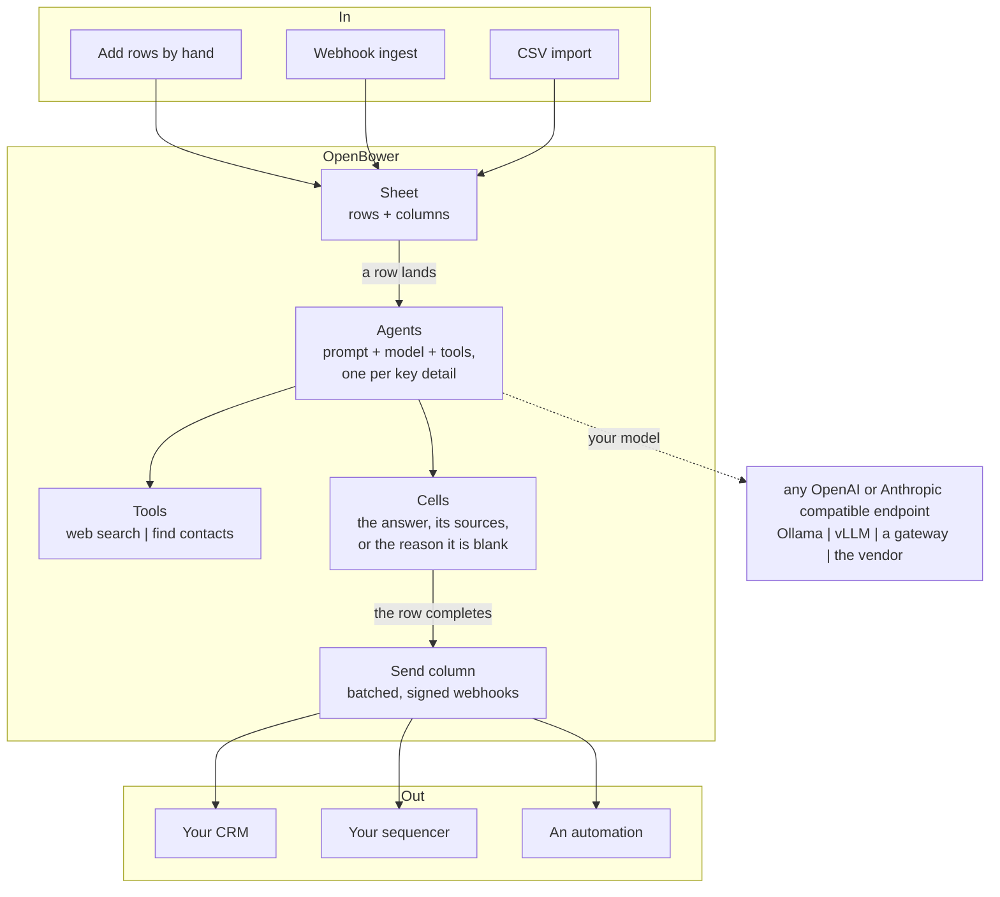

<p align="center">
  
</p>

<p align="center">
  Open-source sales intelligence
</p>

<p align="center">
  <a href="LICENSE"></a>
</p>

<p align="center">
  <b><a href="https://openbower.com/">openbower.com</a></b> |
  <a href="#quickstart">Quickstart</a> |
  <a href="#how-it-works">How it works</a> |
  <a href="CHANGELOG.md">Changelog</a> |
  <a href="CONTRIBUTING.md">Contributing</a>
</p>

---

> [!TIP]
> **Don't want to run it yourself?** A hosted version is on the way: join the waitlist at [openbower.com](https://openbower.com/). Or run it on your own machine: `make up` on a clone, see [Quickstart](#quickstart).

## What it does

OpenBower is an open-source, self-hostable Clay alternative. Build agentic GTM workflows that turn raw signals into researched rows.

<!-- PLACEHOLDER: a screenshot or GIF of a sheet mid-fill (a row lands, its cells resolve, the Send column delivers). Lands here, width 900, like the sibling projects' tours. -->

**Key capabilities**

- **Signals in.** Rows arrive by hand, by webhook, or from a CSV, and every arrival kicks off the necessary agents the moment it lands.
- **An agent per detail.** Build an agent once (a prompt, a model, the tools it may use) and reuse it on every sheet.
- **Get notified.** A Send column waits for the required work to finish, then notifies you or syncs completed rows to your CRM, sequencer, or automation over signed webhooks.
- **Bring your own model.** Any OpenAI or Anthropic compatible endpoint, including one on your laptop, so the whole pipeline runs for $0 while you prove your idea.
- **Self-host free, or hosted.** Run it on your own machine forever, or [join the waitlist](https://openbower.com/) for the hosted version.
- **Everything before hello, automated.** A row lands, the agents research it, the finished row reaches your sequencer. The conversation is yours.

## Why OpenBower

- **Built for builders.** Closed tools are built for venture-backed startups and organizations past product-market fit, so they price heavily to get started. If you can run code and have the compute, you should be able to run the tools yourself, at cost. That is what OpenBower is for: arming founders with tools they can run at cost while they find fit, and offering a managed version to graduate to when it is time to scale.
- **Orchestration is not inference.** Platforms resell vendor models at a markup. Here the coordination runs on your compute and the model costs what the vendor charges, or nothing when it's a model you run.
- **Plug in anything.** Closed tools give everyone the same data sources, so every outreach starts from the same foundation. Here you can plug in any information source as a tool or as a signal that starts your workflow. Standing out is what closes deals.

## Quickstart

Docker Compose v2.24 or newer and a clone:

```bash
git clone https://github.com/obris-dev/openbower.git
cd openbower
make up
```

<!-- PLACEHOLDER: a one-line installer (curl | sh) that clones, checks prerequisites, and runs make up, once one exists. -->

`make up` builds the images, seeds `apps/core/.env`, `config/providers.toml` and `config/tools.toml` from their templates, and serves: the app on http://localhost:3003, the marketing site on http://localhost:3004, the API on :8002. The containers bind-mount the checkout, so edits hot-reload without a rebuild. `make logs` tails everything; `make stop` halts the stack in place and `make up` resumes it; `make reset` wipes the database for a clean start. `make help` lists every target. Every service in the stack, and the environment facts a deploy needs, are in [DEPLOY.md](DEPLOY.md).

> [!WARNING]
> **Signing in needs an identity provider**, which is a separate service: the hosted one, or a local instance of it in development. The app is an OAuth client of it, and the provider only completes a login for callback URLs it has registered, so a self-host on your own domain cannot sign in until the registration handshake on the roadmap lands (a device flow, or a pasted token). Until then a self-host is a local-development affair. The data service behind similar-companies discovery is a separate service in the same way, and optional. Both are reached by name over a docker network called `openbower-suite`, which `make up` creates.

### Prereq: a model

OpenBower is bring-your-own-model; the stack does not bundle one. Inference sources (their structure and their keys) live in one file, `config/providers.toml`, seeded from `config/templates/providers.example.toml`. A section names a registered provider spec, and any source that speaks it is a first-class entry:

- **On your laptop.** The seeded default is a local Ollama, reached from the containers at `http://host.docker.internal:11434/v1`. New here? Install [Ollama](https://ollama.com/download), then `ollama pull gemma4:12b && ollama serve`, and pick the model in the agent builder.
- **Your own deployment.** A vLLM box, a gateway, or any server that speaks the OpenAI or Anthropic protocol: add a section with its `base_url`. Self-hosted servers work keyless.
- **The vendor itself.** OpenAI or Anthropic, with an `api_key` inline; the canonical vendors stay out of the catalog until a key is present.

A typo'd section refuses startup with the section named, so a broken config never runs silently.

### Prereq: search vendors

Tool vendors and their wiring live in `config/tools.toml`, seeded from its template. Web search runs through DuckDuckGo by default (free, keyless). Finding contacts needs a metered vendor's table filled in ([Serper](https://serper.dev)); wiring `web_search` to it routes web search through it too. On the free door a fill is budgeted: one whose search count would exceed the budget is refused before it spends, naming the metered next step. `manage.py tools` prints the live matrix.

### Use it

Open the app, create a sheet (or import a CSV), configure your agentic columns, then start adding rows. Each row's details land as its research completes, and a Send column syncs finished rows wherever you send from.

## How it works



1. New rows land on a sheet, by hand, by webhook, or from a CSV.
2. Agentic workflows run as the rows land, adding the details that matter for your GTM play.
3. As the details land, the results sync to your CRM, sequencer, or automation, or you get notified, so you act in real time instead of checking the sheet.

## Roadmap

Today the engine runs on signals you source yourself: a row you add, a webhook you wired, a CSV you had. Next, the common signals come built in: a fundraise, a leadership change, a hiring spike, a job post, a product launch. Nothing to wire; each one lands as a row and notifies you when its research is ready. The moment something relevant happens, it reaches you first, so you're in front of the right person while it still matters.

Which signal would start a play for you? Open an issue and say.

## Hosted version

Self-hosting is free and stays free. A hosted version (we run the engine for you: always on, listening for your GTM signals) is in the works as the paid tier, a hosting fee rather than credits.

Join the waitlist at [openbower.com](https://openbower.com/).

## Documentation

- [CONTRIBUTING.md](CONTRIBUTING.md): contribution flow, branch naming, running the checks.
- [CHANGELOG.md](CHANGELOG.md): notable changes per release.
- [DEPLOY.md](DEPLOY.md): the self-host footprint, service by service, and the environment it needs.
- [SECURITY.md](SECURITY.md): reporting a vulnerability.
- [AGENTS.md](AGENTS.md): the design conventions, plus the web workspace's own in [web/AGENTS.md](web/AGENTS.md).

<!-- PLACEHOLDER: Community (Discussions, the pinned signals thread) once the repo is public. -->

## License

OpenBower is open source under the [Apache License 2.0](LICENSE), with additional terms reserving an optional `ee/` directory for future commercial features.
